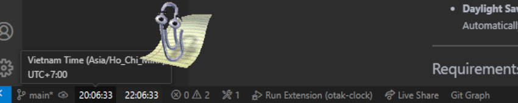

  <h1 align="center">otak-clock</h1>
  

    VSCode extension for displaying dual time zones with alarm functionality - Supports all global time zones with intuitive interface and visual notifications.
  

---

## Usage

For Time Zone Display:

1. Click on either time display in the status bar
2. Select a region from the dropdown menu
3. Choose a specific timezone from the available options
4. The extension will:
   - Display the selected time zone in 24-hour format (HH:mm:ss)
   - Show detailed timezone information on hover
   - Update in real-time
   - Maintain your preferences between sessions

For Setting Alarms:

1. Click the bell icon ($(bell)) in the status bar
2. Enter your desired alarm time in HH:mm format
3. The alarm will:
   - Display in the status bar for quick reference
   - Trigger visual notifications at the specified time
   - Auto-dismiss after notification
   - Maintain a simple, one-alarm-at-a-time system

## Features

otak-clock is a powerful VSCode extension that provides dual time zone display and alarm functionality for developers working across different time zones.

### Key Features

- **Dual Time Zone Display**:
  - Real-time display of two different time zones
  - Comprehensive list of time zones grouped by region
  - 24-hour time format (HH:mm:ss)
  - Detailed timezone information on hover
  - Persistent timezone preferences

- **Simple Alarm System**:
  - Single alarm with visual notifications
  - Easy time setting (HH:mm format)
  - Status bar alarm time display
  - Visual notification feedback
  - Auto-dismissing notifications

- **Status Bar Integration**:
  - Clean and intuitive interface
  - Quick access to time zone selection
  - Clear alarm status indicators
  - Efficient screen space usage

## Commands

- **`otak-clock.selectTimeZone1`**: Change the first time zone
- **`otak-clock.selectTimeZone2`**: Change the second time zone
- **`otak-clock.setAlarm`**: Set a new alarm time

## Extension Settings

This extension is designed to be simple and user-friendly with no additional configuration required. All features are accessible through the status bar interface:

- Time zone displays can be clicked to change settings
- Alarm icon shows current status and settings
- Visual indicators for active alarms

### Status Bar Indicators

- $(bell) HH:mm - Shows active alarm and its time
- $(bell) $(add) - Indicates no active alarm, clickable to set
- HH:mm:ss - Current time in selected time zones

## Related Extensions
Check out our other VS Code extensions.

### [otak-monitor](https://marketplace.visualstudio.com/items?itemName=odangoo.otak-monitor)
Real-time system monitoring in VS Code. Track CPU, memory, and disk usage through the status bar with comprehensive tooltips and 1-minute averages.

### [otak-proxy](https://marketplace.visualstudio.com/items?itemName=odangoo.otak-proxy)
One-click proxy configuration for VS Code and Git. Perfect for environments where network settings change frequently.

### [otak-committer](https://marketplace.visualstudio.com/items?itemName=odangoo.otak-committer)
Intelligent SCM operations with AI support. Features multilingual commit message generation (25 languages supported) and upcoming PR management capabilities.

### [otak-restart](https://marketplace.visualstudio.com/items?itemName=odangoo.otak-restart)
Quick restart operations for Extension Host and VS Code window via status bar tooltip. Streamlines your development workflow.

### [otak-clock](https://marketplace.visualstudio.com/items?itemName=odangoo.otak-clock)
Display date and time for two time zones from around the world in VS Code. Essential for working across different time zones.

### [otak-pomodoro](https://marketplace.visualstudio.com/items?itemName=odangoo.otak-pomodoro)
Enhance your productivity with this Pomodoro Timer extension. Helps balance focused work sessions with refreshing breaks using the Pomodoro Technique.

### [otak-zen](https://marketplace.visualstudio.com/items?itemName=odangoo.otak-zen)
Experience a distraction-free workflow with otak-zen. This extension transforms your VS Code interface into a minimalist environment by hiding non-essential UI elements, allowing you to focus solely on coding. Customize which components to show or hide, and toggle zen mode quickly via commands or the status bar.

## License

This project is licensed under the MIT License - see the LICENSE file for details.

---

For more information, visit the [GitHub repository](https://github.com/tsuyoshi-otake-system-exe-jp/otak-clock).